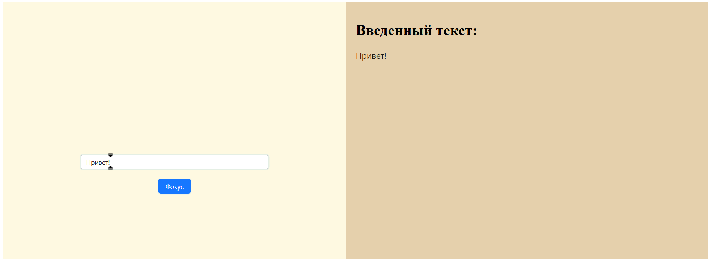

# CostumInput
При нажатии на кнопку фокус устанавливается на input, а введенный текст отображается в отдельном блоке. Также реализовано очищение поля ввода при нажатии клавиши Enter.

## Технологии

- React
- Ant Design
- React Hooks (useRef, useState)

## Использование

- Введите текст в поле
- Нажмите кнопку "Установить фокус" для установки фокуса
- Нажмите Enter для очистки поля
- Введенный текст будет отображаться в правой колонк